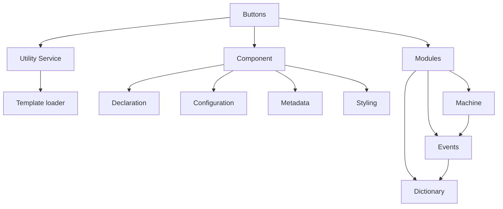

# Button

[API Documentation](https://flippiecoetser.github.io/Buttons/)

Over engineered web component button with:
1. Declarative Interface 
2. Imperative Interface 
3. Finite State Machine
4. Custom Styling and HTML Template

### Dependencies




module dependencies are managed using NPM Packages.

```javascript
{  "dependencies": {
    "@browser-modules/dictionary": "^1.0.8",
    "@browser-modules/events": "^1.1.1",
    "@browser-modules/machine": "^1.0.2",
    "@browser-modules/web.component": "^1.0.9"
  }
}
```
To enable the browser to find the modules, HTML Importmaps is used:  

```html
<script type="importmap">
    {
        "imports": {
            "@browser-modules/dictionary": "../node_modules/@browser-modules/dictionary/lib/dictionary.js",
            "@browser-modules/events": "../node_modules/@browser-modules/events/lib/events.js",
            "@browser-modules/machine": "../node_modules/@browser-modules/machine/lib/machine.js",
            "@browser-modules/web.component": "../node_modules/@browser-modules/web.component/lib/component.js"
        }
    }
</script>
```

The finite state machine is an optional module which enable the support of complex workflows. 
This is a good example of how the dependency tree works.

External dependencies is simply loaded using the import keyword, as declared in the different modules: 
```typescript
// Inside Machine
import { Event as Emitter } from "@browser-modules/events"

// Inside Events
import { Dictionary } from "@browser-modules/dictionary";
```


### Running Demo

To explore and manually interact with the the components imperative interface follow these steps:

1. Get Started:

    1. Start Live Server and verify the component is visible in Chrome Browser
    2. Open Developer Tools in Chrome Browser
    3. Select the Console in the Developer Tools
    4. Verify the component loaded successfully  

2. Load the component into the Console:

```js
var button = document.querySelector('button-pin')
```